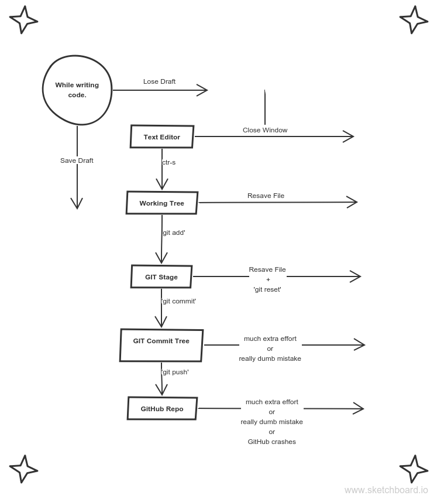

# Git and Hub 101

### Index
* [Why Git and GitHub](#why-git-and-github)
* [what is GitHub](#what-is-github)
* [How it all fits](#how-it-all-fits)
* [Git clients](#git-clients)
* [Learning Outcomes](#learning-outcomes)
* [SSH Keys](#ssh-keys)
* [Study Resources](#study-resources)

---
## Why GIT and GitHub 
* GIT: To organize your development process and protect your codebase against human error.
* GitHub: Because finished code isn't a finished project.  

In the colaborative world of web development, a project (or your piece of one) isn't finished until someone else can understand it - be it a co-worker, collaborator, yourself in a month, or some rando. GIT and Github allows you to protect your code against silly mistakes, organize, and document your code so others know how to use it and what to use it for.

[TOP](#index)
___
## What is GitHub 
tl;dr - it can be anything you need it to be.  

We'll be discussing the following uses in this course:
* Remote hosting for Git repositories.  With pushing and pulling, you can use GitHub to back up your work.  If you stop there, you're a fool. GitHub can do so much more for you.
* [Personal portfolio](https://elewa-student.github.io). GitHub has built-in tools for hosting static pages. With a little ingenuity this can be used to build a portfolio that's fully integrated with your GitHub account.

These are for you to explore on your own:
* Social network and linkedin for developers.
* Project hosting and project management.
* An infinite library of useful code to study or use. 
* Interactive documentation.
* Integrator with many apps - we used sketchboard.io's integration for this diagram.
* 

We've created our curriculum entirely on GitHub relying mostly on these features: github pages, organizations, and repos.

[TOP](#index)
___

## How it all fits

Git is like a really **epic save button** for your files and directories - officially Git is called a version control system.

To compare, a *save* in a text editor would record all of the words of a document as a single file. You are only ever given one record of the file like `essay.doc` unless you make duplicate copies (which would be difficult to remember to do and keep track of):

`essay-draft1.doc`, `essay-draft2.doc`, `essay-final.doc`

A *save* in Git however, would record differences of files and folders AND keep a **historical record of each save**. This feature is a game changer. As an individual developer, Git enables you to review how your project grows and to easily look at or restore file states from the past. Once connected to a network, Git allows you to push your project to GitHub for shari ng and collaborating with other developers.

While Git works on your *local* machine, GitHub is a *remote* storage facility on the web for all your coding projects. This means that by learning Git, you will get to showcase your portfolio on GitHub! This is really important because almost all software development companies consider the ability to use Git as an **essential skill for a modern web developer** to have; having a portfolio will provide proof to future potential employers as to what you are capable of.

In the next lesson we will go over the basic workflow of using Git which should enhance your understanding and demonstrate why Git is so useful.

And finally, you will set up a project with Git and this will serve as a template for setting up your future projects.

[TOP](#index)
___
## Git Clients

Git can be tricky to use directly from terminal when you are first learning.  Fortunately the way git works in the background means that it is very easy to visualize what's happening with a desktop application.  These applications are called Git Clients.  There are many out there, so we will just mention 3 here:

* [Visual Studio Code](https://www.youtube.com/watch?v=VOwyH2-VCVY&t=2s).  Yes indeed, VSC has built-in tools to help you with git.  You can clone, branch, commit and more.  This may be the best option for starting out, the less you have to switch between applications the easier it will be to learn.
* [GitHub Desktop](https://desktop.github.com).  Created by GitHub, this client is simple and easy to use.  It's not as powerful as others but it's more than enough to complete the precourse.
* [GitKraken](https://www.gitkraken.com).  This is the full-powered developer's git tool.  Keep it in mind for later.

[TOP](#index)
___

## Learning Outcomes:
By the end of this step in the Precourse you should be able to:

* Describe the differences between Git, Github and a text editor in terms of what they save and their record keeping
* Describe why Git is useful for an individual developer and a team of developers
* Push, pull, branch, add, commit.  These commands will be necessary to complete the next round of projects.

[TOP](#index)
___   
## SSH Keys
Read [this article](https://jdblischak.github.io/2014-09-18-chicago/novice/git/05-sshkeys.html) to learn why SSH keys are so useful and how to use them.  This will make your life much easier.

[TOP](#index)
___

## Resources:

* [Launch School's Git and Github](https://launchschool.com/books/git/). Resource for learning about git and github.
* [Git and Github in plain English](https://blog.red-badger.com/blog/2016/11/29/gitgithub-in-plain-english).  Out standing overview.

___
___
### 